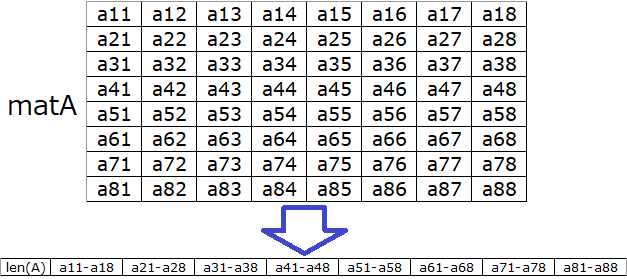

# RobotSystem2017HW-02
ロボットシステム学 課題2-ROS

## 概要
ROSを用いて別のプログラムからドットマトリクスLEDを制御する
* Blink.py: LEDの行列の1、0を反転、データ列へ変換し送信
* LED.py: データ列の受信、LEDへの出力を制御

## 課題内容
作成したプログラムの流れを記述する。

1. **Blink.py:** `8*8` の行列を定義する
```
    mat=[
        [0,0,0,0,0,0,0,0],
        [0,1,0,0,0,0,1,0],
        [0,0,0,0,0,0,0,0],
        [0,0,0,1,1,0,0,0],
        [0,0,0,1,1,0,0,0],
        [0,0,0,0,0,0,0,0],
        [0,1,0,0,0,0,1,0],
        [0,0,0,0,0,0,0,0]
    ]
```
1. **Blink.py:** 行列を次のようなデータ列に変換する

1. **Blink.py->LED.py:** `Int32MultiArray` でパブリッシャ側(Blink.py)からサブスクライバ側(LED.py)へ送信
1. **LED.py:** 受信したデータ列のヘッダから列数を取得
1. **LED.py:** 列数分のデータを1行当たりのデータとして変数に格納
1. **LED.py:** ドットマトリクスLEDの1行ごと **点灯、消灯** を繰り返す
1. **Blink.py:** 行列の1と0を反転させる

# 動画
[動画: hoge](https://google.com)
